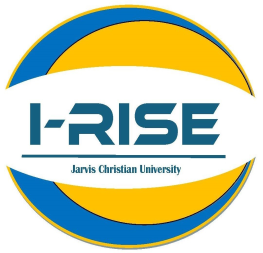
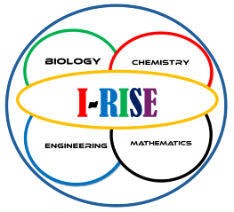
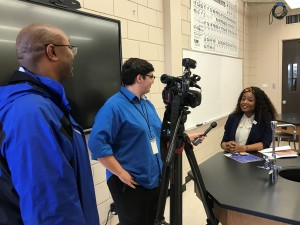
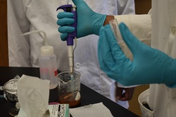
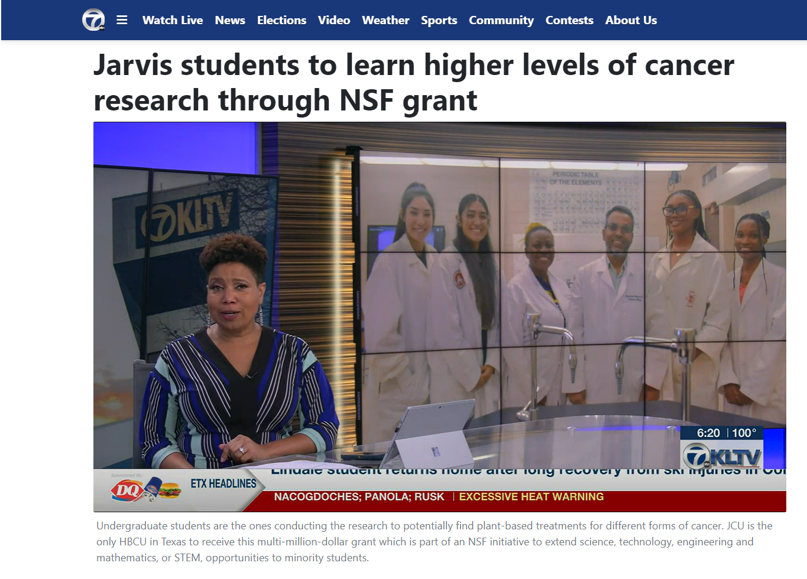
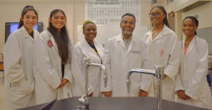

# Interdisciplinary Research Infusion into STEM Education (I-RISE) Project

---

                       

This five year project is funded by NSF with the award number 2306625.
[https://www.nsf.gov/awardsearch/showAward?AWD_ID=2306625](https://www.nsf.gov/awardsearch/showAward?AWD_ID=2306625&HistoricalAwards=false)

---

## ABSTRACT

---

Implementation Projects provide support to the Historically Black Colleges and Universities (HBCUs) to design, implement, study, and assess comprehensive institutional efforts to increase the numbers of students and the quality of their preparation by strengthening science, technology, engineering and mathematics (STEM) education and research. This project at Jarvis Christian University (JCU) seeks to train a diverse group of students by making innovative connections between education, interdisciplinary STEM research, and social learning strategies. The goal of this project is to increase the number of underrepresented minority students pursuing STEM degrees to be competitive for graduate and professional schools. The project will impact the academic success, retention, and graduation rate of students enrolled in STEM degrees and make sustainable change to STEM programs at the institution.

The project seeks to address several causal factors of STEM student achievement gaps through implementation and extension of evidence-based teaching in the STEM areas. The infusion of Course-based Undergraduate Research Experiences (CUREs) into lower-level STEM courses will expose students early to hands-on research approaches with the potential to advance their understanding of their chosen field and promote critical thinking skills. The project will gain insight into the effects of interventions on social learning strategies, including growth mindset, sense of belonging, and self-efficacy. In addition, the development of the new Engineering program will provide a strong general foundation in the field of engineering and equip students to excel in higher-level courses and engineering specializations. Moreover, student participation in faculty mentored research during the academic year and summer will contribute to the advancement of faculty research and increase JCU STEM students? ability to compete successfully for graduate research fellowships. Finally, this opportunity will promote new and expanded collaborations for degree and research opportunities with other institutions through the establishment of the Interdisciplinary Research and Education Center (IREC). The project, which may serve as a model for broad STEM intervention, will be assessed to determine the impact of faculty mentoring, internships, research experiences, and social learning strategies on the outcomes of retention and graduation rates of STEM majors.

This award reflects NSF's statutory mission and has been deemed worthy of support through evaluation using the Foundation's intellectual merit and broader impacts review criteria.

---

## Team Member: 

---

 

**Name and Roles:** Shakhawat Bhuiyan, PhD. Principal Investigator (PI), Professor of Biology.         
**Affilition:** Jarvis Christian University.  
**Research Interests:** Cancer Research with Bioactive Compounds and Nanoparticles.                               
**Email:** [sbhuiyan@jarvis.edu](mailto:sbhuiyan@jarvis.edu)                              

---

 

**Name and Roles:** Widodo Samyono, PhD. Co-Principal Investigator (Co-PI), Associate Professor of Mathematics.                                       
**Affilition:** Jarvis Christian University. 
**Research Interests:** Computational and Mathematical Biology.                           
**Email:** [wsamyono@jarvis.edu](mailto:wsamyono@jarvis.edu)                                          
**LinkedIn:** [https://www.linkedin.com/in/widodosamyono/](https://www.linkedin.com/in/widodosamyono/)                                                     

---

    

**Name and Roles:** Glendora Carter, PhD. Co-Principal Investigator (Co-PI), Professor of Chemistry.              
**Affilition:** Jarvis Christian University.
**Research Interests:** Biochemistry Nanoparticles.                        
**Email:** [gcarter@jarvis.edu](mailto:gcarter@jarvis.edu)                                                      

---

    

**Name and Roles:** Kenie Moses, PhD. Co-Principal Investigator (Co-PI), Associate Professor of Engineering.  
**Affilition:** Southern University at Shreveport Louisiana.       
**Research Interests:** Engineering Education and Electircal Engineering.                                      
**Email:** [kmoses@susla.edu](mailto:kmoses@susla.edu)                      

---

    

**Name and Roles:** Yefer Suarez-Buitrago, PhD. Co-Principal Investigator (Co-PI), Associate Professor of Physics and Mathematics.                        
**Affilition:** Jarvis Christian University.
**Research Interests:** Nuclear Physics.                            
**Email:** [ybuitrago@jarvis.edu](mailto:ybuitrago@jarvis.edu)                              

---

## Team Support:         

---

     

**Name and Roles:** Antoinesha Hollman, PhD. Director of Summer Bridge Program, Assistant Professor of Biology.             
**Affilition:** Jarvis Christian University.
**Email:** [ahollman@jarvis.edu](mailto:ahollman@jarvis.edu)                                                   

---

**Name and Roles:** Gwendolyn Lee, MSW. Director of Social Study, Assistant Professor of Social Work.                                        
**Affilition:** Jarvis Christian University.
**Email:** [glee@jarvis.edu](mailto:glee@jarvis.edu)                                                             

-----------

# PROGRAMS

---

## I-RISE SUMMER BRIDGE PROGRAM (I-RISE SBP) 
This is 4 weeks summer training research in biology, chemistry, computational and mathematical biology, and pre-engineering. See the news I-RISE SUMMER BRIDGE PROGRAM FOR HIGH SCHOOL SENIORS INTERESTED IN STEM CAREERS. Interested students may check the flyer below and scan the QR Code to apply for the program.  

This is 8 weeks summer internship undergraduate research in cancer research, mathematical modeling, and engineering research. Under the faculty supervision the students conduct undergraduate research to prepare for career, graduate studies, and workforces in STEM. Interested students may check the flyer below and scan the QR Code to apply for the program.

------

# NEWS

---

## KLTV FEATURES JARVIS I-RISE SUMMER BRIDGE PROGRAM

Jarvis Christian University was featured on the local ABC affiliate, KLTV, in a story about a new I-RISE Summer Bridge Program that provides students with a $500 stipend, four weeks of research experience alongside scientists doing real research, and free room and board, Up to 50 high school seniors can attend.  Juniors in high school can apply, however, seniors will get priority slots. 
                                                                  
  

Read the News resource from JCU Blog post on the link below.

[https://www.jarvis.edu/blog/post/kltv-features-jarvis-i-rise-summer-bridge-program](https://www.jarvis.edu/blog/post/kltv-features-jarvis-i-rise-summer-bridge-program)

---

## JARVIS CHRISTIAN UNIVERSITY TO HOST I-RISE SUMMER BRIDGE PROGRAM FOR HIGH SCHOOL SENIORS INTERESTED IN STEM CAREERS

Jarvis Christian University is offering a four-week Interdisciplinary Research Infusion into Science Education (I-RISE) program for graduating high school seniors interested in Science, Technology, Engineering, and Mathematics (STEM) careers.  The program runs from Monday, June 3, through Friday, June 28, on the campus of JCU in Hawkins, Texas.

Application deadline is Monday, April 8.

Training by real scientists, college preparedness, free room and board, and a $500 stipend is available to those who qualify. The Summer Bridge Program is funded by the National Science Foundation I-RISE. 

Interested high school seniors should contact Dr. Antoinesha L. Hollman, director of the I-RISE Summer Bridge Program at ahollman@jarvis.edu or by calling (903) 730-4890, ext. 4001.

Working with the I-RISE Summer Bridge Program this summer are Professor of Biology and NSF grant principal investigator Dr. Shakhawat Bhuiyan, Professor of Chemistry and NSF grant co-principal investigator Dr. Glendora Carter, Associate Professor of Physics Dr. Yefer M. Suarez, Associate Professor of Mathematics Dr. Widodo Samyono, Associate Professor of Engineering and Technology Dr. Kennie Moses and Assistant Professor of Social Work and project manager Gwendolyn Lee.

        

Read the News resource from JCU Blog post on the link below.

[https://www.jarvis.edu/blog/post/jarvis-christian-university-to-host-i-rise-summer-bridge-program-for-high-school-seniors-interested-in-stem-careers](https://www.jarvis.edu/blog/post/jarvis-christian-university-to-host-i-rise-summer-bridge-program-for-high-school-seniors-interested-in-stem-careers)

---

## Jarvis students to learn higher levels of cancer research through NSF grant

TYLER, Texas (KLTV) - Jarvis Christian University is one of five historically Black colleges and universities, or HBCUs, that received a grant from the National Science Foundation for their groundbreaking undergraduate cancer cell research.

Undergraduate students are the ones conducting the research to potentially find plant-based treatments for different forms of cancer.

The lab currently has five young women who are working with plants and spices to extract nanoparticles and biomedical compounds that could have cancer-fighting properties.

Their names are Itzel Soto, Patricia Soto, Daniella Johnson, Esther Chicou and Chinaza Jennifer Okwuoma.

Check the News resource from KLTV website on the link below.

[https://www.kltv.com/2023/07/20/webxtra-jarvis-christian-college-awarded-25m-undergraduate-cancer-research-program/](https://www.kltv.com/2023/07/20/webxtra-jarvis-christian-college-awarded-25m-undergraduate-cancer-research-program/)

---

## JARVIS CHRISTIAN UNIVERSITY IN HAWKINS, TEXAS, AWARDED $2.25 MILLION NATIONAL SCIENCE FOUNDATION GRANT

Jarvis Christian University biology professor Dr. Shakhawat Bhuiyan is the principal investigator on a new $2.25 million National Science Foundation (NSF) grant titled “Interdisciplinary Research Infusion into STEM Education Undergraduate Program.” The new NSF grant continues over the next five years, with a start date of August 1, 2023, and running through July 31, 2028.  Each year, Jarvis will submit an annual project report in accordance with the award terms and conditions.  

 

“This continuing grant gives students the opportunity to research plant-based bioactive compounds and nanoparticles to potentially develop new treatments for cancer,” Bhuiyan said.

This new NSF funding opportunity is made in accordance with NSF 20-559 Historically Black Colleges and Universities Undergraduate Program. Co-principal investigators include Jarvis Christian University professors Dr. Glendora Carter, Dr. Widodo Samyono, and Dr. Yefer Suarez, along with Southern University and A&M College System professor Dr. Kenie R. Moses. Jarvis Assistant Professor of Social Work Gwendolyn Lee will be the project manager of this grant to conduct social sciences research with the students.

“We are very proud of the ongoing work in research that Dr. Bhuiyan does with his colleagues and students," said Jarvis Christian University President Glenell M. Lee-Pruitt, Ph.D.  "We commend him and support his efforts to bring research scholarship to East Texas by way of Jarvis Christian University.”

The project seeks to train a diverse group of students by making innovative connections between education and research in science, technology, engineering, and mathematics (STEM) and to increase the number of underrepresented minority students pursuing STEM degrees. The project is expected to impact the academic success, retention, and graduate rate of students enrolled in STEM degrees and make sustainable changes to the STEM programs at JCU.

Working on the NSF grant will enable Jarvis students to be competitive for consideration for graduate and professional schools by having done interdisciplinary STEM research and social learning strategies as undergraduates.  Students will gain insight into the effects of interventions on social learning strategies, including growth mindset, sense of belonging, and self-efficacy.

 “The infusion of Course-based Undergraduate Research Experiences into lower-level STEM courses exposes students early to hands-on research with the potential to advance student understanding of their chosen field and to promote critical thinking skills,” Dr. Bhuiyan said. “Student participation in faculty-mentored research during the academic year and summer internships contributes to students’ ability to compete successfully for graduate research fellowships.” 

The project the students will work on involves hands-on research in the biomedical sciences, mathematical modeling, and an introduction to engineering program, Bhuiyan said. 

“The students will study plant-based bioactive compounds and green synthesis of nanoparticles in the potential treatment and drug development to find natural answers to combat growing cancer cells,” Bhuiyan said.  Students will be using orchids, aloe vera plants, mint, a variety of grapes, berries, and other fruits, cacti, and an assortment of vegetables and spices. 

Students will have the opportunity as undergraduates to conduct biomedical research, learn computational and mathematical modeling, write, and present their peer-reviewed research at conferences. 

Moreover, student participation in faculty-mentored research during the academic year and summer will contribute to the advancement of faculty research and increase JCU STEM students’ ability to compete successfully for graduate research fellowships.

Finally, this opportunity will promote new and expanded collaborations for degree and research opportunities with other institutions through the establishment of the Interdisciplinary Research and Education Center.

 In addition, the development of the new engineering program will provide a strong general foundation in the field of engineering and equip students to excel in higher-level courses and engineering specializations.

Jarvis Christian University is dedicated to empowering students to achieve their career goals through an affordable academic experience that prepares them for today’s global economy. Whether a student is a recent high school graduate or a working adult seeking career advancement, Jarvis Christian University develops students of all ages intellectually, socially, spiritually, and emotionally.  

Read the News resource from JCU Blog post on the link below.

[https://www.jarvis.edu/blog/post/jarvis-christian-university-in-hawkins-texas-awarded-225-million-national-science-foundation-grant](https://www.jarvis.edu/blog/post/jarvis-christian-university-in-hawkins-texas-awarded-225-million-national-science-foundation-grant)

Local ABC affiliate KLTV Channel 7 came out to talk to Dr. Bhuiyan and the students. From the link below you may check the story by reporter Lauren Tear. 

[https://www.kltv.com/2023/07/20/webxtra-jarvis-christian-college-awarded-25m-undergraduate-cancer-research-program/](https://www.kltv.com/2023/07/20/webxtra-jarvis-christian-college-awarded-25m-undergraduate-cancer-research-program/)

---
